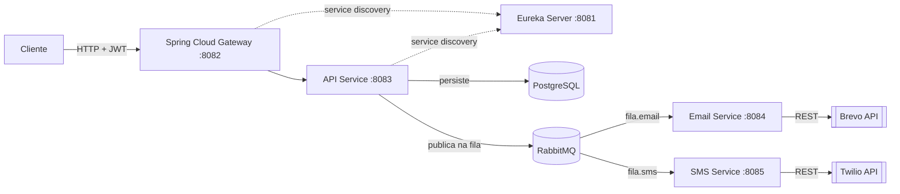

🚀 Notification System Microservices
Sistema de notificações multi-canal (Email e SMS) desenvolvido com Spring Boot, RabbitMQ e arquitetura de microserviços.
è um sistema que realizao envios de mensagens para duas apis  uma  de sms e outra de email,  e para rodar o projeto primeiramente voce precisa de realizar o registros na duas apis Twilio (provedor de sms) e Brevo( provedor de email e inserir as chaves de API no .env).

🛠️ Tecnologias Principais

    Java 17 / Spring Boot
    RabbitMQ (Mensageria e Prioridade)
    PostgreSQL (Persistência)
    Eureka Server (Service Discovery)
    Spring Cloud Gateway (API Gateway)
    Twilio (Provedor SMS)
    Brevo (Provedor Email)

🏗️ Arquitetura

O Gateway roteia as requisições autenticadas (JWT) para a API, que persiste os dados no PostgreSQL e publica a notificação na fila correspondente do RabbitMQ. Os serviços de Email e SMS consomem suas filas de forma assíncrona e disparam o envio via Brevo e Twilio, respectivamente. Todos os serviços se registram no Eureka para descoberta.

🚦 Como Iniciar
1. Gerar as chaves RSA (usadas para assinar/validar os JWTs)

A API assina os tokens JWT com um par de chaves RSA lido de `api/src/main/resources/private.key` (PKCS#8) e `public.pem` (X.509). Gere o seu próprio par — não reutilize chaves de exemplo:

    openssl genrsa -out keypair.pem 2048
    openssl rsa -in keypair.pem -pubout -out api/src/main/resources/public.pem
    openssl pkcs8 -topk8 -inform PEM -outform PEM -nocrypt -in keypair.pem -out api/src/main/resources/private.key
    rm keypair.pem

Esses arquivos ficam fora do controle de versão (`.gitignore`) — cada ambiente (dev, produção) deve gerar o seu próprio par.

2. Configuração de Variáveis de Ambiente
Crie um arquivo chamado .env na raiz do projeto e preencha com suas credenciais:
env

# .env na raiz do projeto
    TWILIO_SID=seu_sid_aqui
    TWILIO_TOKEN=seu_token_aqui
    API_TOKEN_EMAIL=sua_api_key_brevo
    API_DOMAIN=seu_email_remetente_verificado_na_brevo
    NUMBER_SMS=

Use code with caution.
### 3. Subir os Containers
Certifique-se de que o Docker está rodando e execute:

    docker-compose up -d --build

    Ou docker compose up -d --build dependendo da sua versão.

Cada serviço tem um `healthcheck` no `docker-compose.yaml`, então o Postgres, o RabbitMQ e o Eureka precisam estar de fato saudáveis (não só "iniciados") antes que a API, o SMS e o Email subam — evita falhas de conexão na inicialização. Acompanhe com:

    docker-compose ps

📡 Endpoints e Fluxo de Uso
A porta principal de entrada via Gateway é: http://localhost:8082/api-service/api
### Autenticação (Acesso Aberto)
A API utiliza JWT (Bearer Auth). Primeiro, registre-se e obtenha seu token.

    Registrar: POST /auth/register
        Payload: {"username": "seu_user", "password": "sua_senha"}

    Login: POST /auth/login
        Payload: {"username": "seu_user", "password": "sua_senha"}
        Importante: Copie o token recebido na resposta.

### 3. Enviar Notificação (POST /notifications)
O sistema valida o destinatário dinamicamente com base no canal escolhido.
Exemplo EMAIL:
json

    {
    "channel": "EMAIL",
    "recipient": "usuario@email.com",
    "message": "Sua fatura chegou!",
    "priority": "HIGH"
    }

### Exemplo SMS:
json

    {
    "channel": "SMS",
    "recipient": "+5511999999999",
    "message": "Seu código de verificação é 1234",
    "priority": "MEDIUM"
    }

## 4. Consultar Notificações (GET /notifications)
Retorna o histórico de notificações enviadas pelo usuário autenticado.
📖 Documentação Swagger
    Para visualizar e testar os endpoints interativamente, acesse:
    🔗 http://localhost:8083/api/swagger-ui/index.html
🏗️ Resumo da Infraestrutura

| Serviço | Porta | Descrição |
| :--- | :--- | :--- |
| **Gateway** | 8082 | Porta de entrada unificada |
| **API** | 8083 | Processamento e validação |
| **Eureka** | 8081 | Service Discovery |
| **Email** | 8084 | Consumer (Brevo) |
| **SMS** | 8085 | Consumer (Twilio) |
| **RabbitMQ** | 15672 | Painel de controle (UI) |
