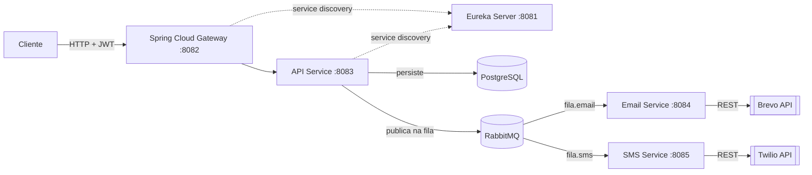

# 🚀 Notification System — Microservices


Sistema de notificações multi-canal (Email e SMS) construído com Spring Boot e arquitetura de microserviços. Um cliente autenticado via JWT envia uma notificação para a API, que a publica no RabbitMQ; os serviços de Email e SMS consomem suas respectivas filas de forma assíncrona e disparam o envio através da Brevo e da Twilio.

## 📑 Sumário

- [Tecnologias](#️-tecnologias-principais)
- [Arquitetura](#️-arquitetura)
- [Como iniciar](#-como-iniciar)
- [Endpoints e fluxo de uso](#-endpoints-e-fluxo-de-uso)
- [Documentação Swagger](#-documentação-swagger)
- [Infraestrutura](#️-resumo-da-infraestrutura)
- [Segurança](#-segurança)

## 🛠️ Tecnologias Principais

| Categoria | Tecnologia |
| :--- | :--- |
| Linguagem / Framework | Java 17, Spring Boot |
| Mensageria | RabbitMQ (filas com prioridade) |
| Persistência | PostgreSQL |
| Service Discovery | Eureka Server |
| API Gateway | Spring Cloud Gateway |
| Autenticação | JWT assinado com par de chaves RSA |
| Provedor de SMS | Twilio |
| Provedor de Email | Brevo |
| Infraestrutura | Docker / Docker Compose |

## 🏗️ Arquitetura



O Gateway roteia as requisições autenticadas (JWT) para a API, que persiste os dados no PostgreSQL e publica a notificação na fila correspondente do RabbitMQ. Os serviços de Email e SMS consomem suas filas de forma assíncrona e disparam o envio via Brevo e Twilio, respectivamente. Todos os serviços se registram no Eureka para descoberta.

## 🚦 Como Iniciar

### Pré-requisitos

- Docker e Docker Compose
- Uma conta na [Twilio](https://www.twilio.com/) (provedor de SMS) e na [Brevo](https://www.brevo.com/) (provedor de Email), com as respectivas chaves de API
- OpenSSL (para gerar o par de chaves RSA do passo 2)

### 1. Clonar o repositório

```bash
git clone https://github.com/ruanvaldezdev/notifications.git
cd notifications
```

### 2. Gerar as chaves RSA (usadas para assinar/validar os JWTs)

A API assina os tokens JWT com um par de chaves RSA lido de `api/src/main/resources/private.key` (PKCS#8) e `public.pem` (X.509). Gere o seu próprio par — não reutilize chaves de exemplo:

```bash
openssl genrsa -out keypair.pem 2048
openssl rsa -in keypair.pem -pubout -out api/src/main/resources/public.pem
openssl pkcs8 -topk8 -inform PEM -outform PEM -nocrypt -in keypair.pem -out api/src/main/resources/private.key
rm keypair.pem
```

Esses arquivos ficam fora do controle de versão (`.gitignore`) — cada ambiente (dev, produção) deve gerar o seu próprio par.

### 3. Configurar as variáveis de ambiente

Crie um arquivo `.env` na raiz do projeto:

```env
TWILIO_SID=seu_sid_aqui
TWILIO_TOKEN=seu_token_aqui
API_TOKEN_EMAIL=sua_api_key_brevo
API_DOMAIN=seu_email_remetente_verificado_na_brevo
NUMBER_SMS=seu_numero_twilio
```

### 4. Subir os containers

```bash
docker-compose up -d --build
# ou, dependendo da versão do Docker:
docker compose up -d --build
```

Cada serviço tem um `healthcheck` no `docker-compose.yaml`, então o Postgres, o RabbitMQ e o Eureka precisam estar de fato saudáveis (não só "iniciados") antes que a API, o SMS e o Email subam — evita falhas de conexão na inicialização. Acompanhe com:

```bash
docker-compose ps
```

## 📡 Endpoints e Fluxo de Uso

A porta principal de entrada via Gateway é: `http://localhost:8082/api-service/api`

### 1. Autenticação (acesso aberto)

A API utiliza JWT (Bearer Auth). Primeiro, registre-se e obtenha seu token.

**Registrar** — `POST /auth/register`
```json
{ "username": "seu_user", "password": "sua_senha" }
```

**Login** — `POST /auth/login`
```json
{ "username": "seu_user", "password": "sua_senha" }
```
> Copie o token recebido na resposta e use-o como `Authorization: Bearer <token>` nas próximas requisições.

### 2. Enviar notificação — `POST /notifications`

O sistema valida o destinatário dinamicamente com base no canal escolhido.

**Exemplo EMAIL:**
```json
{
  "channel": "EMAIL",
  "recipient": "usuario@email.com",
  "message": "Sua fatura chegou!",
  "priority": "HIGH"
}
```

**Exemplo SMS:**
```json
{
  "channel": "SMS",
  "recipient": "+5511999999999",
  "message": "Seu código de verificação é 1234",
  "priority": "MEDIUM"
}
```

### 3. Consultar notificações — `GET /notifications`

Retorna o histórico de notificações enviadas pelo usuário autenticado.

## 📖 Documentação Swagger

Para visualizar e testar os endpoints interativamente, acesse:

🔗 http://localhost:8083/api/swagger-ui/index.html

## 🏗️ Resumo da Infraestrutura

| Serviço | Porta | Descrição |
| :--- | :--- | :--- |
| **Gateway** | 8082 | Porta de entrada unificada |
| **API** | 8083 | Processamento e validação |
| **Eureka** | 8081 | Service Discovery |
| **Email** | 8084 | Consumer (Brevo) |
| **SMS** | 8085 | Consumer (Twilio) |
| **RabbitMQ** | 15672 | Painel de controle (UI) |

## 🔒 Segurança

- Credenciais (Twilio, Brevo, banco de dados) ficam apenas no `.env`, que nunca é versionado.
- As chaves RSA usadas para assinar os JWTs (`private.key`/`public.pem`) também ficam fora do controle de versão — cada ambiente gera o seu próprio par (veja o passo 2 acima).
- Os consumers de fila (SMS e Email) tratam falhas de envio sem derrubar a aplicação, evitando que uma mensagem travada bloqueie a fila indefinidamente.

---

Desenvolvido por [Ruan Valdez](https://github.com/ruanvaldezdev).
